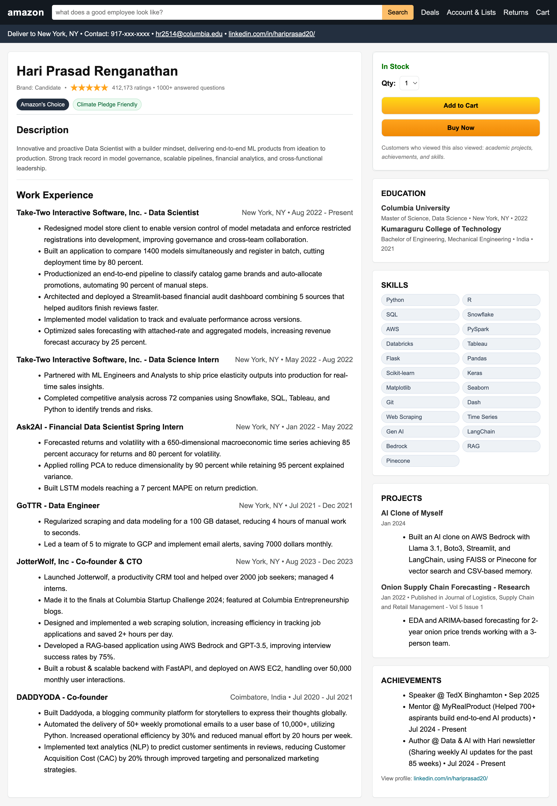

# Amazon‑Style Resume (HTML + CSS)

Turn your CV into a scroll‑stopping **Amazon product page**. Built with a single HTML file + CSS.

---

## 📸 Preview

<div>
  
</div>

---

## 💼 MyRealProduct — Build real AI products (not just projects)

**MyRealProduct** is a 4‑week live cohort where Data Scientists and Analysts learn by **shipping** end‑to‑end AI products — portfolio‑ready, recruiter‑friendly.

- Weekly live sessions + code walkthroughs
- Product briefs, checklists, and review cycles
- Community accountability + mentor feedback

👉 **Join the upcoming workshop:** [Reserve your seat →](https://myrealproduct.com)\

> Want this resume customized for you during the cohort? We’ll help you tailor it to your story and ship it together.

---


## 🚀 Quick start (How to clone this Resume?)

1. **Clone the repo**
   ```bash
   git clone https://github.com/hariPrasadCoder/linkedin.git
   cd <your-repo>
   ```
2. **Open the resume**
   - Click the button at the top of this README or open `resumes/amazon_resume.html` in your browser.
3. **Customize**
   - Find the `<!-- Work Experience -->`, `<!-- Education -->`, `<!-- Skills -->` blocks inside the file and replace with your details.
   - Colors live at the top under `:root { ... }`.

> Tip: If you want a live, rendered link on GitHub, enable **GitHub Pages** (Settings → Pages → Deploy from main → root). Then link the page as your "Live Demo" below.


## 📥 Make it yours

If you create your own version, tag the repo or drop a star ⭐. PRs that improve accessibility or add themes are welcome!


---

## 🙌 Credits

- Design inspired by the Amazon product page UI
- Built by **Hari Prasad Renganathan** — [LinkedIn](https://linkedin.com/in/hariprasad20/)